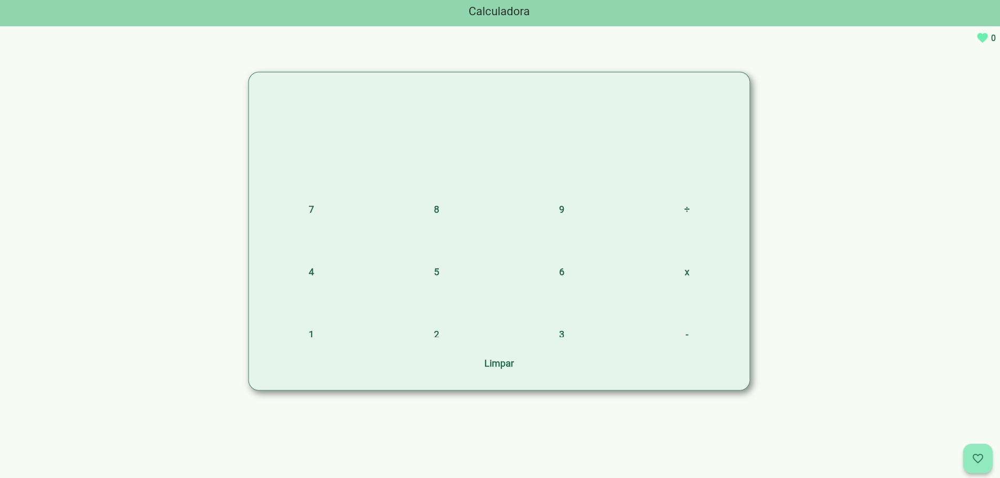

# App Calculadora 🔢  

Este é um aplicativo de **calculadora** simples desenvolvido em **Flutter** (Dart), que permite realizar **todas as operações básicas** como soma, subtração, multiplicação e divisão.  

Além disso, conta com um **mini contador de cliques embutido**: basta clicar para aumentar a contagem! 

## 🖼️ Preview do App  
  

🔗 **Acesse o app aqui:** [Clique para usar](https://avrilstihler.github.io/app-calculadora/)  

## Funcionalidades  
✅ **Operações matemáticas básicas** ( + , - , × , ÷ )  
✅ **Mini contador de cliques** integrado  
✅ **Design responsivo**, adaptado para celulares e desktops  
✅ **Exportado para Web**, permitindo uso direto no navegador  

  

